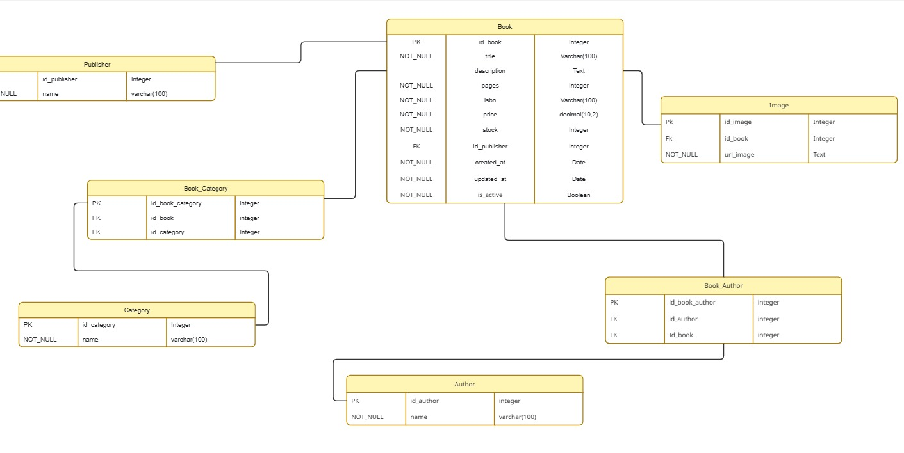

# Microservicio Catalogue

El microservicio Cata
logue es una API REST desarrollada con Spring Boot para la gestión de libros, autores, categorías, editoriales e imágenes dentro de un catálogo digital.

Permite realizar operaciones CRUD, búsquedas dinámicas, paginación y actualizaciones parciales mediante endpoints REST.

## tabla de contenido

- [Arquitectura general](#arquitectura-general)
- [Estructura del proyecto](#Estructura-del-proyecto)
- [Modelo Relacional](#modelo-relacional)
- [Docker](#docker)
- [Endpoints](#endpoints-principales)
- [Paginación y busqueda](#paginación-y-búsquedas)
- [Soft Delete](#soft-delete)
- [DTOs y Mappers](#dtos-y-mappers)
- [Validaciones](#validaciones)
- [Manejo de excepciones](#manejo-de-excepciones)


# Arquitectura General

El proyecto sigue una arquitectura en capas:

```
Controller
↓
Service
↓
Repository
↓
Database
```

Cada capa tiene una responsabilidad específica:

Capa	Responsabilidad
Controller	Exponer endpoints REST
Service	Lógica de negocio
Repository	Acceso a datos
Mapper	Conversión Entity ↔ DTO
Exception	Manejo de errores
Predicate	Búsquedas dinámicas

# Estructura del Proyecto

```
src/main/java/com/unir/catalogue
│
├── controller
│   └── model
│
├── service
│
├── repository
│   ├── model
│   └── predicate
│
├── mapper
│
├── exception
│
├── config
│
└── CatalogueApplication
```

# Modelo Relacional



## Entidades Principales

### Book

Representa un libro dentro del catálogo.

Relaciones:

```
ManyToOne → Publisher
ManyToMany → Author
ManyToMany → Category
OneToMany → Image
```

### Author

Representa los autores de los libros.

### Category

Representa las categorías literarias.

### Publisher

Representa las editoriales.

### Image

Representa las imágenes asociadas a un libro.

## Docker

### Crear contenedor MySQL

```
docker run --name catalogue-mysql \
-e MYSQL_ROOT_PASSWORD=1234 \
-e MYSQL_DATABASE=catalogue \
-p 3306:3306 \
-d mysql:8
```

### Scripts

#### Crear schema

Ejecutar [schema.sql](src/main/resources/db/schema.sql)

### Crear indices

Ejecutar [indices.sql](src/main/resources/db/indices.sql)

### Insertar datos

Ejecutar [insert.sql](src/main/resources/db/insert.sql)

# Endpoints Principales

## Books

 Método | Endpoint | Descripción | Request Body | Response |
|---|---|---|---|---|
| GET | `/api/books` | Obtener libros | - | `List<BookResponseDto>` |
| GET | `/api/books/{id}` | Obtener libro por ID | - | `BookResponseDto` |
| POST | `/api/books` | Crear libro | `BookRequestDto` | `BookResponseDto` |
| PUT | `/api/books/{id}` | Actualizar libro | `BookRequestDto` | `BookResponseDto` |
| PATCH | `/api/books/{id}` | Actualización parcial | `BookPatchDto` | `BookResponseDto` |
| DELETE | `/api/books/{id}` | Soft delete | - | `204 No Content` |
| GET | `/api/internal/books/{id}/detail` | Obtener detalles internos del libro | - | `BookResponseDto` |
| POST | `/api/internal/books/stock/increase` | Aumentar stock de libros | `BooksQuantityRequestDto` | `204 No Content` |
| POST | `/api/internal/books/stock/decrease` | Disminuir stock de libros | `BooksQuantityRequestDto` | `204 No Content` |

## Author

| Método | Endpoint | Descripción | Request Body | Response |
|---|---|---|---|---|
| GET | `/api/authors` | Obtener autores | - | `List<AuthorResponseDto>` |
| GET | `/api/authors/{id}` | Obtener autor por ID | - | `AuthorResponseDto` |
| POST | `/api/authors` | Crear autor | `AuthorRequestDto` | `AuthorResponseDto` |
| PUT | `/api/authors/{id}` | Actualizar autor | `AuthorRequestDto` | `AuthorResponseDto` |
| DELETE | `/api/authors/{id}` | Eliminar autor | - | `204 No Content` |

## Category

| Método | Endpoint | Descripción | Request Body | Response |
|---|---|---|---|---|
| GET | `/api/categories` | Obtener categorías | - | `List<CategoryResponseDto>` |
| GET | `/api/categories/{id}` | Obtener categoría por ID | - | `CategoryResponseDto` |
| POST | `/api/categories` | Crear categoría | `CategoryRequestDto` | `CategoryResponseDto` |
| PUT | `/api/categories/{id}` | Actualizar categoría | `CategoryRequestDto` | `CategoryResponseDto` |
| DELETE | `/api/categories/{id}` | Eliminar categoría | - | `204 No Content` |

## Publisher

| Método | Endpoint | Descripción | Request Body | Response |
|---|---|---|---|---|
| GET | `/api/publishers` | Obtener editoriales | - | `List<PublisherResponseDto>` |
| GET | `/api/publishers/{id}` | Obtener editorial por ID | - | `PublisherResponseDto` |
| POST | `/api/publishers` | Crear editorial | `PublisherRequestDto` | `PublisherResponseDto` |
| PUT | `/api/publishers/{id}` | Actualizar editorial | `PublisherRequestDto` | `PublisherResponseDto` |
| PATCH | `/api/publishers/{id}` | Actualización parcial | `PublisherPatchDto` | `PublisherResponseDto` |
| DELETE | `/api/publishers/{id}` | Eliminar editorial | - | `204 No Content` |

# Paginación y Búsquedas

El microservicio implementa búsquedas dinámicas mediante:

- Specification
- Predicate
- SearchCriteria

Ejemplo:

```
GET /api/books/search?title=spring&price=100
```

## Paginación

```
GET /api/books?page=0&size=10
```

# Soft Delete

El borrado lógico se realiza mediante el campo:

```
private Boolean isActive;
```

Cuando un libro es eliminado:

```
book.setIsActive(false);
```

# DTOs y Mappers

El proyecto utiliza DTOs para desacoplar las entidades JPA de la API REST.

## DTOs principales

| DTO            | Uso                    |
|----------------|------------------------|
| BookRequestDto | 	Crear libros          |
| BookPatchDto   | 	Actualización parcial |
|BookResponseDto | Respuesta API |

## Mapper

Los mappers convierten:

```
DTO → Entity
Entity → DTO
```

Ejemplo:

```
BookMapper.toResponse(book)
```

# Validaciones

Se utilizan validaciones mediante Jakarta Validation:

- @NotBlank
- @NotNull
- @Size

Ejemplo:

```
@NotBlank(message = "Title requerido")
private String title;
```

# Manejo de Excepciones

El proyecto implementa excepciones personalizadas:

- BookNotFoundException
- AuthorNotFoundException
- CategoryNotFoundException
- PublisherNotFoundException

## Ejemplo Request POST

```
{
"title": "Clean Architecture",
"description": "Arquitectura de software",
"pages": 450,
"isbn": "9780134494166",
"price": 120.50,
"stock": 10,
"idPublisher": 1,
"idAuthors": [1, 2],
"idCategories": [3],
"urlImages": [
"https://image1.jpg",
"https://image2.jpg"
]
}
```

## Ejemplo Request PATCH

```
{
"price": 150.00,
"stock": 20
}
```